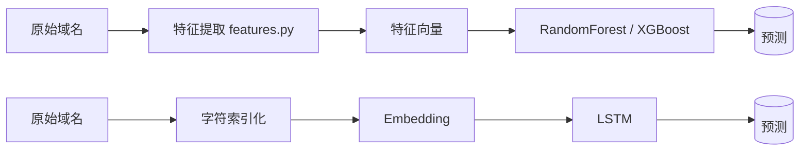
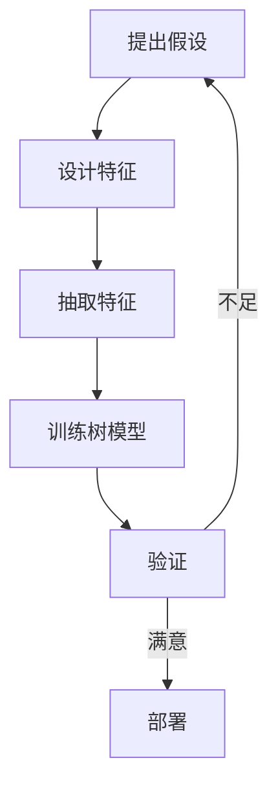
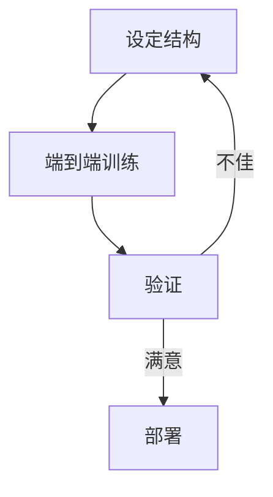

# DGA 域名检测综合对比实验 (RandomForest / XGBoost / LSTM)

本项目统一集成三种方法：
1. 基于手工特征的 RandomForest (RF)
2. 基于手工特征的 XGBoost
3. 基于字符序列端到端表示的 LSTM (可利用 GPU 加速)

目标：提供从特征工程、传统树模型到简单神经网络的端到端对比，方便教学与实验扩展。

## 数据
本目录已包含本地数据集副本：`DGA_综合对比实验/dga_training_data.csv` (60000 行, 50/50)
列：`domain,label`，label ∈ {legit, dga}；不再依赖其它目录。

## 目录结构
```
DGA_综合对比实验/
  features.py            # 手工特征（RF/XGB 使用）
  train_classical.py     # 训练 RF + XGB 并保存
  lstm_model.py          # LSTM 模型结构
  train_lstm.py          # 训练 LSTM + early stopping
  compare_models.py      # 统一评估 RF / XGB / LSTM
  interactive_predict.py # 交互式预测 (支持 /switch 模型 + 手动输入)
  requirements.txt       # 依赖 (含 torch / xgboost)
  artifacts_classical/   # RF/XGB 训练输出 (运行后生成)
  artifacts_lstm/        # LSTM 训练输出 (运行后生成)
```

## 安装
```bash
pip install -r DGA_综合对比实验/requirements.txt
```
若需 GPU：请按官方指引安装对应 CUDA 版本的 torch。

## 1. 训练传统模型 (RF + XGBoost)
```bash
python DGA_综合对比实验/train_classical.py \
  --csv DGA_综合对比实验/dga_training_data.csv \
  --out DGA_综合对比实验/artifacts_classical \
  --rf-est 150 --xgb-est 300
```
输出：
- `rf_model.joblib` / `xgb_model.joblib`
- `bigram_probs.json`

## 2. 训练 LSTM 序列模型
```bash
python DGA_综合对比实验/train_lstm.py \
  --csv DGA_综合对比实验/dga_training_data.csv \
  --out DGA_综合对比实验/artifacts_lstm \
  --epochs 10 --batch-size 256 --device cuda
```
参数说明：
- `--max-len` 截断/填充的最大域名字符数 (默认 40)
- `--embed-dim` / `--hidden-dim` 控制模型容量
- `--patience` F1 未提升多少轮后 early stop (默认 3)

## 3. 模型对比评估
(需先完成两类训练)
```bash
python DGA_综合对比实验/compare_models.py \
  --csv DGA_综合对比实验/dga_training_data.csv \
  --classical-dir DGA_综合对比实验/artifacts_classical \
  --lstm-dir DGA_综合对比实验/artifacts_lstm
```
示例输出：
```
=== Model Comparison ===
RandomForest  -> accuracy:0.999x | precision:0.999x | recall:0.999x | f1:0.999x | roc_auc:0.999x
XGBoost       -> accuracy:0.999x | precision:0.999x | recall:0.999x | f1:0.999x | roc_auc:0.999x
LSTM          -> accuracy:0.998x | precision:0.998x | recall:0.998x | f1:0.998x | roc_auc:0.998x
```
(示例值仅供参考，实际数据简单，指标可能接近 1.0)

## 4. 交互式预测 (保留原 quick_test 手动输入功能并扩展)
```bash
python DGA_综合对比实验/interactive_predict.py \
  --classical-dir DGA_综合对比实验/artifacts_classical \
  --lstm-dir DGA_综合对比实验/artifacts_lstm \
  --model rf
```
交互示例：
```
Running initial sample predictions with model= rf
1df5hr42x3s651dgh56tdbq6bs.org           -> dga   (p_dga=1.0000)
675wwi1hb3y9w1griggr1vxpg33.net          -> dga   (p_dga=1.0000)
cloud.gist.build                         -> legit (p_dga=0.0000)
knotch.it                                -> legit (p_dga=0.0000)
auth.example.com                         -> legit (p_dga=0.0000)

Enter domains (empty line to exit). Model= rf
Type /switch rf|xgb|lstm to change model during session.
> /switch lstm
Switched model to lstm
> knotch.it
knotch.it                                -> legit (p_dga=0.xxx)
> 
```

## 设计差异说明
| 方法 | 输入表示 | 优势 | 劣势 |
|------|----------|------|------|
| RF | 手工特征 | 训练快, 可解释性好 | 需精心特征设计 |
| XGBoost | 手工特征 | 更强拟合与调参空间 | 仍依赖特征工程 |
| LSTM | 字符序列 | 可学习模式/避免特征偏见 | 需更多数据+调参, 速度慢 |

## 可能的改进
## LSTM 不依赖 `features.py` 的原因说明
与 RF / XGBoost 使用的 `features.py` 手工特征不同，LSTM 采取端到端字符序列建模，原因与考量如下：

1. 表示方式不同：树模型只能接受固定长度的数值特征向量，因此需要把域名转换成统计/规则特征；而 LSTM 能直接处理变长字符序列，通过嵌入 + 时序结构自动学习模式。
2. 人工特征迭代成本高：经典模型效果高度依赖人工设计与多轮试验（添加/删除/重组：长度、熵、数字/元音比例、重复度、n-gram 统计等）。每次假设都需重新抽取、训练、验证。LSTM 则把“选哪些特征 + 如何组合”交给多层神经网络参数（Embedding → LSTM 隐状态 → 全连接），在端到端梯度优化中自动完成特征选择/组合，减少人工调参在特征空间的反复摸索。信息熵的计算公式为：
$$H(X) = -\sum_{i=1}^{n} P(x_i) \log_2 P(x_i)$$ 
<center>*其中 $P(x_i)$ 是字符 $x_i$ 在序列中的概率分布。*</center>
<br>

3. 特征可扩展性：当需要引入新的字符（例如 punycode、Unicode、分隔符）时，LSTM 只需在 vocab 中加入即可；若继续依赖 `features.py`，需同步修改多处统计逻辑，增加维护成本。
4. 防止信息重复与泄漏：若再将手工特征拼接给 LSTM，可能让其“捷径”依赖这些高区分度统计量，掩盖模型对序列结构模式的学习，不利于分析其单独能力；当前设计刻意分离，形成清晰对比基线。
5. 代码解耦 / 关注点分离：`features.py` 主要服务于基于统计特征的流水线；LSTM 的数据前处理（字符索引化、padding、batch 组装、Embedding）完全不同，单独实现更清晰，避免交叉修改引入回归。
6. 未来扩展友好：后续若加入 Transformer / CNN / 混合模型，可直接复用当前序列管线；保持与传统特征工程模块松耦合，便于并行演化。
7. 特征搜索 vs. 参数学习：传统手工特征 = 人为“预定义 + 穷举组合”搜索；LSTM 特征 = 通过梯度下降在连续嵌入/隐空间里进行“软搜索”，往往能在相同或更少的人力下找到更丰富的判别模式。

总结：LSTM 选择只依赖原始域名字符串，是为了：
（a）保持端到端序列学习的纯粹性，
（b）降低人工多轮特征试错成本，
（c）减少维护耦合，
（d）提高对新型 / 变体 DGA 的潜在鲁棒性。
手工特征模块则继续提供快速、可解释的传统模型 baseline，二者在“可解释性 vs. 自动表征能力”之间形成互补。

- LSTM 改为双向 + 多层 + Attention / Transformer encoder
- 字符 embedding 加入位置编码或卷积前处理
- 使用更丰富的 n-gram 特征与词典扩展
- 增加噪声域名 / 混淆样本提高泛化
- 引入半监督 / 伪标签扩充 legit 样本

### 可视化：经典手工特征流水线 vs. LSTM 端到端

#### 1) 总览对比图


> 若仍无法渲染（某些 Markdown 引擎内置 Mermaid 版本较旧），请使用下方 ASCII 流程或手动在 mermaid.live 在线查看。

#### 2) 特征工程循环 vs 端到端训练循环





#### 3) ASCII 简化视图

```
经典: domain -> handcrafted stats -> vector -> RF/XGB -> label
LSTM: domain -> char ids -> embedding -> LSTM seq encode -> sigmoid -> label
```

#### 4) 关键差异速览

| 维度 | 经典手工特征 | LSTM 端到端 |
|------|--------------|-------------|
| 特征获取 | 人工枚举/统计 | 自动学习隐表示 |
| 迭代成本 | 频繁改代码/重抽取 | 主要调结构/超参 |
| 可解释性 | 高 (特征重要性) | 中等/低 (需可视化工具) |
| 对新模式适应 | 取决于是否已编码该统计 | 可能通过字符组合泛化 |
| 训练时间 | 快 (特征少) | 相对慢 (序列反向传播) |
| 风险 | 特征泄漏/过拟合某统计 | 过拟合/欠拟合需正则 |

> 注：Mermaid 图在 GitHub / 支持渲染的 Markdown 查看器中可视化；如不支持，可参考 ASCII 简化视图。


## 性能 & 资源建议
- 如果 GPU 存在且数据增大 (≥ 数百万样本)，LSTM/Transformer 更具意义
- 当前 6 万行在 CPU 上训练 LSTM 也较快；GPU 能加速调参迭代

## 安全注意事项
模型仅用于安全检测辅助，需人工复核；切勿将高置信度当作绝对判定。线上部署应加入：
- 阈值调优 / PR 曲线监控
- 日志与漂移监控
- 模型版本回滚机制

## 运行顺序速查
```bash
# 1. 训练 RF + XGB
python DGA_综合对比实验/train_classical.py --csv DGA_综合对比实验/dga_training_data.csv --out DGA_综合对比实验/artifacts_classical

# 2. 训练 LSTM
python DGA_综合对比实验/train_lstm.py --csv DGA_综合对比实验/dga_training_data.csv --out DGA_综合对比实验/artifacts_lstm --device cuda

# 3. 评估对比
python DGA_综合对比实验/compare_models.py --csv DGA_综合对比实验/dga_training_data.csv --classical-dir DGA_综合对比实验/artifacts_classical --lstm-dir DGA_综合对比实验/artifacts_lstm

# 4. 交互测试
python DGA_综合对比实验/interactive_predict.py --classical-dir DGA_综合对比实验/artifacts_classical --lstm-dir DGA_综合对比实验/artifacts_lstm --model rf
```

## 解释与可视化 (特征重要性 vs 序列显著性)
新增 `explain.py` 支持对同一个域名并排展示：
1. 树模型 (RF/XGB) 的手工特征重要性贡献 (feature_value * importance)
2. LSTM 每个字符的梯度范数 (saliency) + 对应时间步隐藏状态向量范数

用法示例：
```bash
python DGA_综合对比实验/explain.py \
  --classical-dir DGA_综合对比实验/artifacts_classical \
  --lstm-dir DGA_综合对比实验/artifacts_lstm \
  --domain 1df5hr42x3s651dgh56tdbq6bs.org \
  --model rf
```
输出片段示例：
```
=== Classical Feature Contributions (sorted by |value*importance|) ===
Feature                           Value       Imp   Value*Imp
entropy                           4.1800    0.1200      0.5016
length                           25.0000    0.0600      1.5000
... (截断)

=== LSTM Token Saliency & Hidden State Norms ===
Predicted p(dga)=0.9998
00 1  grad:0.4521 ████████   hid:1.2034 ▓▓▓▓▓▓▓▓
01 d  grad:0.3010 ██████     hid:0.9987 ▓▓▓▓▓▓▓
02 f  grad:0.2805 █████      hid:0.9500 ▓▓▓▓▓▓
... (逐字符)
```
含义：
- grad 列：对该字符嵌入的梯度 L2 范数，作为 saliency（对当前输出最敏感的字符会更大）。
- hid 列：LSTM 输出隐藏状态向量的 L2 范数，用于观察时间步激活强度。

注意：
- 梯度显著性是局部一阶近似，不等价于因果删除影响；可与随机扰动或积分梯度进一步对比。
- 若想加入积分梯度，可扩展在 `explain.py` 中对 embedding 做 baseline=全零 或 PAD 序列的多步插值。

后续可扩展：
- 保存 saliency JSON 以便前端着色展示
- 集成 SHAP (树模型) + Integrated Gradients (LSTM) 融合报告
- 将隐藏状态降维 (PCA/TSNE/UMAP) 可视化模式聚类


## 许可证
仅供教学与研究，禁止用于恶意用途。
