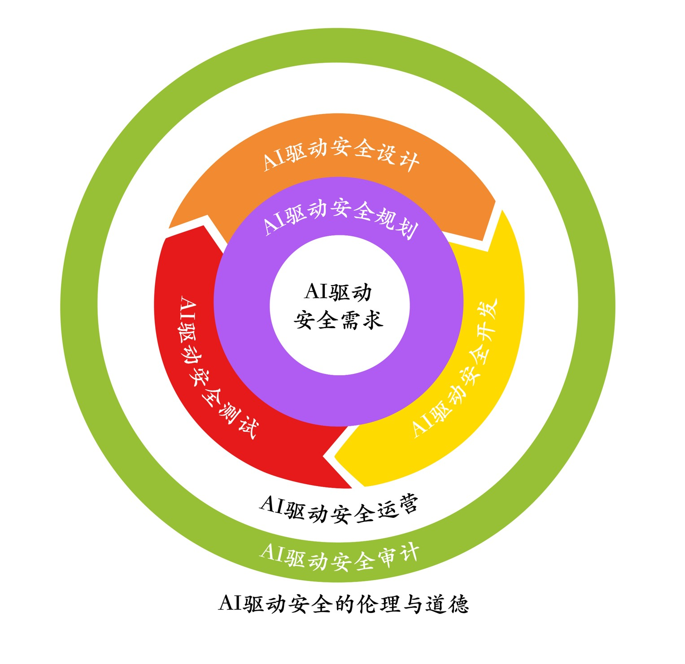

<!-- insert .\[资源]测试文件\caidcp_logo.png-->


# CAIDCP课程代码安全与功能演示集合

欢迎来到CAIDCP课程代码安全与功能演示集合仓库！该仓库汇集了多种常见的代码安全漏洞示例、修复方案以及其他功能性的代码演示。每个子目录都包含一个独立的课题，旨在帮助开发者更好地理解、识别和防范各类安全风险，并探索有趣的功能实现。

## 仓库结构

本仓库包含以下主要部分，每个部分均位于独立的子目录中：

- **安全漏洞示例 (Security Vulnerability Examples)**
- **功能演示 (Feature Demos)**
- **智能检测与机器学习实验 (AI Detection & ML Experiments)**
- **其他资源 (Other Resources)**

---

## 安全漏洞示例

这部分包含了多种常见安全漏洞的简化版代码示例，并附有相应的安全审计报告，旨在揭示漏洞原理和修复建议。

### 1. 命令注入漏洞 (`/命令注入漏洞`)

- **目标**: 演示当应用程序将用户输入直接拼接到操作系统命令中时，可能引发的严重安全问题。
- **内容**:
    - `cmd_injection_vuln.py`: 存在命令注入漏洞的 Python Web 应用。
    - `injected.txt`: 成功注入命令后创建的文件，作为攻击成功的标志。
    - `安全审计报告.md`: 对该漏洞的详细分析和修复建议。
- **使用方法**:
    1. 运行 `pip install -r requirements.txt` (如果需要)。
    2. 运行 `python cmd_injection_vuln.py` 触发漏洞。
    
### 2. XXE 漏洞 (`/XXE漏洞`)

- **目标**: 演示 XML 外部实体注入（XXE）漏洞，攻击者可利用此漏洞读取服务器上的任意文件。
- **内容**:
    - `XXE_vuln.py`: 存在 XXE 漏洞的 Python 应用。
    - `secret.txt`: 模拟的服务器敏感文件。
    - `安全审计报告.md`: 漏洞分析与修复方案。
- **使用方法**:
    1. 运行 `python XXE_vuln.py`。
    2. 可以看到 `secret.txt` 的内容被成功读取。

### 3. 密钥硬编码漏洞 (`/密钥硬编码漏洞`)

- **目标**: 展示将敏感密钥（如 API Key、密码）直接写入代码中的风险。
- **内容**:
    - `hardcode_vuln.py`: 硬编码了敏感密钥的 Python 脚本。
    - `安全审计报告.md`: 分析硬编码的危害及推荐的最佳实践。
- **使用方法**:
    - 直接审查 `hardcode_vuln.py` 即可发现硬编码的密钥。

### 4. URL 重定向漏洞 (`/URL重定向漏洞`)

- **目标**: 演示开放式 URL 重定向漏洞，可能导致钓鱼攻击。
- **内容**:
    - `URL_redirect_vuln.py`: 存在 URL 重定向漏洞的 Flask 应用。
    - `安全审计报告.md`: 漏洞分析与修复方法。
- **使用方法**:
    1. 运行 `python URL_redirect_vuln.py`。
    2. 访问 `http://127.0.0.1:5000/redirect?url=http://evil.com` 来观察恶意重定向。

### 5. Websocket 命令注入漏洞 (`/Websocket命令注入漏洞`)

- **目标**: 演示通过 WebSocket 通信实现的命令注入攻击。
- **内容**:
    - `ws_server_vuln.py`: 存在漏洞的 WebSocket 服务器。
    - `ws_client.py`: 用于与服务器交互的客户端。
    - `安全审计报告.md`: 漏洞分析报告。
- **使用方法**:
    1. 运行 `python ws_server_vuln.py` 启动服务器。
    2.  python vuln_ws_server.py          # 终端1：启动服务
    3.  尝试如下命令：
        ```Bash
        python ws_client.py "."           # 终端2：正常列目录
        ```
        ```Bash
        python ws_client.py ".; touch injected_ws.txt"   # Linux 触发注入（创建文件）
        ```
        ```powershell
        python ws_client.py ". & echo INJECTED> injected_ws.txt" # Windows触发注入（创建文件）
        ```
    4. 查看当前目录下是否生成了 `injected_ws.txt` 文件。

### 6. XSS 漏洞 (`/XSS漏洞`)

- **目标**: 演示跨站脚本（XSS）漏洞，攻击者可借此在用户浏览器中执行恶意脚本。
- **内容**:
    - `XSS_vuln.py`: 存在 XSS 漏洞的 Web 应用。
    - `安全审计报告.md`: 漏洞分析与修复方案。
- **使用方法**:
    1. 运行 `python XSS_vuln.py`。
    2. 通过访问`http://127.0.0.1:5000/?name=<script>alert('XSS')</script>`来触发漏洞。

### 7. 上传文件漏洞 (`/上传文件漏洞`)

- **目标**: 演示文件上传功能中存在的路径遍历漏洞，允许攻击者将文件上传到非预期的目录。
- **内容**:
    - `upload_vuln.py`: 存在文件上传漏洞的 Python 应用。
    - `poc.html`: 用于攻击的验证页面。
    - `安全审计报告.md`: 漏洞分析与修复建议。
- **使用方法**:
    - 运行 `python upload_vuln.py` 
    - 通过如下方式触发攻击：
    ```Bash
    curl -F "file=@poc.html;filename=../../overwritten.html;type=text/html" http://127.0.0.1:5000/upload
    ```
    ```Powershell
    .\Path_Traversal.ps1
    ```
    - 可以发现`overwrite.html`文件在上层目录被成功创建。   

### 8. 日志漏洞 (`/日志漏洞`)

- **目标**: 演示当日志记录了包含敏感信息或恶意字符的用户输入时，可能引发的安全问题。
- **内容**:
    - `logging_vuln.py`: 将用户输入直接写入日志的示例。
    - `安全审计报告.md`: 分析日志注入的风险和防范措施。
- **使用方法**:
    - 运行 `python logging_vuln.py`。
    - 通过如下方式触发日志，观察日志内容暴露出来的敏感信息：
    ```bash
    # Linux/Mac:
    curl -s -X POST http://127.0.0.1:5000/login \
      -H 'Content-Type: application/json' \
      -d '{"username":"alice","password":"SuperSecret123","otp":"123456"}'
    ```
    ```Powershell
    # Windows:
    Invoke-RestMethod -Method POST -Uri http://127.0.0.1:5000/login `
      -ContentType 'application/json' `
      -Body '{"username":"alice","password":"SuperSecret123","otp":"123456"}'
    ```

### 9. DAST动态应用安全测试演示 (`/DAST演示`)

- **目标**: 演示利用AI大语言模型生成多样化、可绕过简单过滤的攻击载荷，进行动态应用程序安全测试。
- **内容**:
    - `app.py`: 一个包含XSS防御机制的Flask应用。
    - `templates/index.html`: 包含输入框的测试页面。
    - `README.md`: 详细的操作指南和AI提示词示例。
- **使用方法**:
    1. 安装依赖: `pip install -r requirements.txt`
    2. 运行应用: `python app.py`
    3. 访问: http://127.0.0.1:5001
    4. 使用AI生成的绕过载荷进行测试。

### 10. Java 死锁演示及修复方法 (`/Java死锁演示及修复方法`)

- **目标**: 通过 Java 代码演示多线程环境下的死锁问题，并提供修复后的版本作为对比。
- **内容**:
    - `DeadlockDemo.java`: 引发死锁的示例代码。
    - `FixedDeadlockDemo.java`: 修复了死锁问题的代码。
- **使用方法**:
    1. 编译 `javac DeadlockDemo.java` 和 `javac FixedDeadlockDemo.java`。
    2. 运行 `java DeadlockDemo` 观察死锁现象（程序会卡住）。
    3. 运行 `java FixedDeadlockDemo` 观察正常执行的结果。

---

## 功能演示

这部分包含了一些具体功能的代码实现。

### 1. 文件上传演示 (`/FileUploadDemo`)

- **目标**: 通过提示词演示`资源使用安全-文件管理`的简单提示词，生成的一个基础的文件上传功能实现。
- **内容**:
    - `app.py`: 实现了文件上传功能的 Flask 应用。
    - `templates/index.html`: 前端上传页面。
- **使用方法**:
    1. 运行 `pip install -r requirements.txt`。
    2. 运行 `python app.py` 启动服务。
    3. 通过浏览器访问 `http://127.0.0.1:5000` 进行文件上传。

### 2. 安全文件上传（`/SecureFileUpload`）

- **目标**: 通过提示词演示`资源使用安全-文件管理`的完整提示词，生成符合《GB/T 38674》文件管理安全要求的强化版图片上传实现，作为 `/FileUploadDemo` 示例的安全对照。
- **核心安全特性**:
        1. 路径安全: 使用 `secure_filename` + 目录约束 + 绝对路径校验防止路径遍历。
        2. 类型双重校验: 扩展名白名单 + Magic Number 校验（PNG/JPG）。
        3. 深度文件完整性验证: 引入 Pillow (`Image.verify()`) 防伪造/截断文件。
        4. 会话密钥安全: 通过环境变量 `FLASK_SECRET_KEY` 或动态随机值生成，杜绝硬编码。
        5. 临时文件安全: `tempfile.mkstemp()` 创建、操作结束后保证清理，避免残留。
        6. 权限/目录检查: 启动时对上传目录权限进行基础审计并输出日志提醒。
        7. 大小与名称限制: `MAX_CONTENT_LENGTH=5MB`、文件名长度限制（<=100字符）。
        8. 统一异常处理: 全局异常捕获，防止栈信息泄露。
        9. 安全日志审计: 成功/失败上传均记录到 `upload.log` （可扩展集中化）。
        10. 禁用生产调试: 仅在 `FLASK_DEBUG=1` 时开启 debug。
- **依赖**: 版本锁定（减少供应链不确定性）
    ```
    Flask==2.3.3
    Werkzeug==2.3.7
    Pillow==10.0.0
    ```
- **关键环境变量（可选）**:
    | 变量名 | 作用 | 示例 |
    | ------ | ---- | ---- |
    | FLASK_SECRET_KEY | 自定义会话密钥 | `set FLASK_SECRET_KEY=yourhexkey` |
    | FLASK_DEBUG | 开启调试（开发环境） | `set FLASK_DEBUG=1` |
- **使用方法**:
        1. 进入目录: `cd SecureFileUpload`
        2. 安装依赖: `pip install -r requirements.txt`
        3. （可选）设置会话密钥: `set FLASK_SECRET_KEY=$(python -c "import secrets;print(secrets.token_hex(32))")`
        4. 启动: `python app.py`
        5. 访问: `http://127.0.0.1:5000/`
        6. 查看日志: 打开同目录下的 `upload.log`
- **与漏洞版本对比**:
        | 维度 | `/上传文件漏洞/upload_vuln.py` | `/SecureFileUpload/app.py` |
        | ---- | ----------------------------- | ------------------------- |
        | 路径校验 | 可能缺失 | 严格限制到固定目录 |
        | 类型校验 | 仅扩展名 | 扩展名 + Magic Number + Pillow |
        | 临时文件 | 直接写入 | 临时保存 + 验证后原子搬移 |
        | 会话密钥 | 不适用/潜在硬编码 | 环境变量/随机生成 |
        | 日志审计 | 缺失 | 成功/失败均记录 |
        | 大小/名称限制 | 无 | 有 |
        | 目录权限检查 | 无 | 启动期提醒 |

> 可根据需要继续扩展：上传频率限制（Flask-Limiter）、集中日志、WAF接入、病毒扫描引擎联动等。

### 3. 标识符可信度验证 (`/标识符可信`)

- **目标**: 演示如何生成和验证具有可信度的标识符。
- **内容**:
    - `gen_id.py`: 生成标识符的脚本。
    - `min_verified_id.py`: 验证标识符的脚本。
- **使用方法**:
    - 按需运行 `python gen_id.py` 或 `python min_verified_id.py`。

### 4. 因果干预和差分检测 (`/因果干预和差分检测`)

- **目标**: 演示了因果干预和差分隐私相关的算法或概念。
- **内容**:
    - `code.py`: 具体的代码实现。
- **使用方法**:
    - 运行 `python code.py` 来执行演示。

### 5. 固定响应时间演示 (`/固定响应时间`)

- **目标**: 展示如何通过固定响应时间来防止基于时间的侧信道攻击。
- **内容**:
    - `responseDelay.py`: 完整版实现，包含详细的时间统计和分析。
    - `responseDelaySimple.py`: 简化版实现，展示核心概念。
- **使用方法**:
    - 运行 `python responseDelay.py` 查看随机延迟与固定延迟的对比结果。
    - 运行 `python responseDelaySimple.py` 了解基本实现原理。

### 6. 交互式页面展示 (`/交互式页面展示`)

- **目标**: 通过一系列交互式HTML页面，展示不同的概念和系统。
- **内容**:
    - `index.html`: 主页面，提供所有演示项目的导航入口。
    - `EARS故事生成/`: 
        - `auditsystem.html`: 审计系统用户故事生成演示
        - `reviewsystem.html`: 评审系统用户故事生成演示
    - `FuzzGPT/`: 
        - `fuzzGPT.html`: FuzzGPT模型架构和工作流程展示
    - `IRIS/`:
        - `iris.html`: IRIS系统架构和工作原理展示
    - `Scapel_VS_FuzzGPT/`:
        - `scapel_vs_fuzzGPT.html`: Scapel和FuzzGPT对比分析
    - `TitanFuzz/`:
        - `titanFuzz.html`: TitanFuzz系统架构和特点展示
    - `上下文工程补充资料/`:
        - `context_engineering.html`: 上下文工程的核心概念和应用
    - `完整性验证与违规处理/`:
        - `integrity_verify.html`: 完整性验证与违规处理流程
    - `AI驱动安全测试全章结构/`:
        - `Module6.html`: AI驱动安全测试章节的完整结构
    - `安全测试目标流派/`:
        - `secure_test.html`: （第六章）安全测试目标与流派对比展示页面
    - `STRIDE演示/`:
        - `stride_demo.html`: （第六章）使用STRIDE方法对MFA系统进行威胁建模的交互演示
        - `stride_results.md`: 威胁分析结果与缓解措施说明
    - `OWASP_ASVS/`:
        - `healthguard.html`: （第六章）基于OWASP ASVS标准的安全加固示例应用
- **使用方法**:
    - 直接在浏览器中打开各个子目录下的 `html` 文件即可查看相应的交互式演示。
    - 每个页面都提供了详细的说明和交互式的内容展示。
 
 ---

## 智能检测与机器学习实验 (AI Detection & ML Experiments)

本章节聚焦安全智能检测场景下的机器学习 / 深度学习基线与对比实验，强调可复现、端到端与教学友好。

### 1. GNN 横向移动威胁检测示范 (`/GNN示范`)

- **目标**: 利用图神经网络（GCN, PyTorch Geometric）在抽象“用户-计算机”混合图上进行风险节点（用户/主机）识别，演示图结构在横向移动攻击链挖掘中的优势。
- **内容**:
  - `gnn_demo.py`: 构建两跳链（源计算机 -> 用户 -> 目标计算机）、定义 GCN、训练与推理。
  - `requirements.txt`: 依赖（含 `torch` 与 `torch-geometric`；PyG 请按官方指引选择与当前 Python / CUDA 版本匹配的轮子）。
  - `README.md`: 图建模思路、特征与实验流程说明。
- **运行**:
  ```powershell
  cd GNN示范
  pip install -r requirements.txt
  python gnn_demo.py
  ```
  输出训练损失 / 指标与高风险节点预测列表。
- **核心要点**:
  - 小型可复现实验子集，降低环境门槛
  - 节点分类直接输出风险实体概率
  - 结构可扩展至 GraphSAGE / GAT / 时间切片 / 异构关系
- **扩展方向**: Temporal Graph、注意力 (GAT)、多任务（阶段标签 + 风险分）、异常子图检测、与 SIEM / 威胁情报融合。

### 2. DGA 域名检测综合对比实验 (`/DGA_综合对比实验`)

- **目标**: 对比传统手工特征 + 树模型（RandomForest / XGBoost）与端到端字符序列 LSTM 在 DGA 域名检测中的性能与可解释性，形成多层次教学基线。
- **内容**:
  - 数据: `dga_training_data.csv`（约 60K 行，良性 : DGA 1:1）
  - 特征工程: `features.py`（长度/字符熵/字符类别比例等）
  - 经典模型: `train_classical.py`（训练 RF & XGBoost，产物存放 `artifacts_classical/`）
  - 深度学习: `train_lstm.py` / `lstm_model.py`（字符嵌入 + LSTM，权重在 `artifacts_lstm/`）
  - 对比 / 解释: `compare_models.py`、`explain.py`、`模型对比解释案例.md`
  - 交互演示: `interactive_predict.py`（输入域名即时预测）
  - 统一依赖: `requirements.txt`
- **典型流程**:
  ```powershell
  cd DGA_综合对比实验
  pip install -r requirements.txt
  python train_classical.py
  python train_lstm.py
  python compare_models.py
  python interactive_predict.py
  ```
- **核心要点**:
  - 同一数据划分保证对比公平
  - 展示“特征工程 + 树”与“端到端表征”在效果 / 训练成本 / 解释性上的权衡
  - 交互脚本便于课堂实时演示
- **扩展方向**: Transformer / CNN 模型、在线特征流水线、SHAP / LIME 深度解释、数据漂移监测、stacking 集成。

### 3. 孤立森林异常检测 (`/孤立森林异常检测`)

- **目标**: 在海量认证日志中使用无监督 `IsolationForest` 识别“多维组合型”潜在异常用户-天行为（横向移动、夜间批量操作、凭证滥用迹象）。
- **内容**:
    - `if_anomaly_detector.py`: 采样加载 → 特征聚合（登录次数 / 夜间次数 / 目标主机数 / 失败次数 / 失败率）→ 训练模型 → 输出 Top 异常并对最可疑样本进行教学化解读。
    - `README.md`: 数据下载（LANL auth.txt.gz 手动获取）、运行步骤、特征说明、示例输出与分析、调参与扩展建议。
- **数据处理策略**:
    - 手动下载并解压 `auth.txt.gz` 到本目录（因原始文件过大，脚本中下载语句已注释）。
    - 仅读取前 1,000,000 行后再随机采样 500,000 行，降低内存与时间成本；可通过调节 `nrows` 与 `sample` 参数适配硬件。
- **运行**:
    ```powershell
    cd 孤立森林异常检测
    # 手动下载并解压 auth.txt 到当前目录后执行：
    pip install pandas scikit-learn numpy
    python if_anomaly_detector.py
    ```
- **示例结果亮点**:
    - 生成 6,662 条用户-天聚合特征记录，检出 447 条潜在异常（具体数量取决于采样与 contamination 参数）。
    - Top1 样本：单日 14,011 次全部夜间登录 + 访问 16 台主机 + 857 次失败（失败率 ~6.1%）→ 明显偏离全局均值（登录均值 ~75）。
    - 通过组合稀有性而非单阈值告警，展示多维协同异常优势。
- **改进方向**: 分块流式聚合 (chunksize)、滚动特征、图结构 (用户-主机二部图) + GNN、SHAP/残差分析、在线增量重训、异常标签半监督迭代。
- **注意**: 需手动下载数据集；避免将大文件 `auth.txt` 入库，可在根 `.gitignore` 中忽略。

---

## 其他资源

### 1. 提示词 Demo (`/提示词Demo`)

- **内容**:
    - `PDD_GBT38674.md`: 是课程基于GB/T38674标准，演示提示词驱动开发（Prompt Driven Development， PDD）的相关示例。
    - `PDD_interact.html`: PDD交互式页面。

### 2. 资源文件 (`/[资源]测试文件`)

- **内容**: 包含一些用于测试的图片等资源文件。

## 如何使用本仓库

1. **克隆仓库**:
   ```bash
   git clone <repository-url>
   ```
2. **进入子目录**:
   根据您感兴趣的课题，进入相应的子目录。
   ```bash
   cd <directory-name>
   ```
3. **安装依赖**:
   大部分 Python 示例依赖 Flask 等库。请在相应目录下使用 `pip` 安装依赖：
   ```bash
   pip install -r requirements.txt
   ```
4. **运行示例**:
   按照每个目录下的说明运行代码。

## 关于CAIDCP
为助力网络安全从业者实现从被动应对到主动防御的能力跃升，云安全联盟大中华区重磅推出**AI驱动安全专家认证（CAIDCP）**培训与认证体系。该认证聚焦AI与网络安全的跨界创新领域，旨在系统性培育兼具AI技术内核与网络安全实战能力的复合型专业人才。

**CAIDCP**匠心打造“认知-实践-前瞻”三维培养体系，以系统化培养模式赋能学员能力进阶：
- 认知层深度剖析AI安全技术的演进脉络与多元应用场景，夯实理论根基；
- 实践层贯穿“需求-规划-设计-开发-测试-运营-审计” 全生命周期实操，通过场景化训练强化工程能力；
- 前瞻层以AI驱动安全伦理为框架，融合高阶应用实战实验，并前瞻行业技术发展趋势，助力学员构建兼具落地性与前瞻性的知识体系。

<!-- insert .\[资源]测试文件\caidcp_cycle.jpg -->


## 免责声明
本仓库中的所有代码仅用于教育和研究目的。请勿在未经授权的情况下用于任何生产环境或非法活动。作者对因使用本仓库代码而造成的任何后果概不负责。
